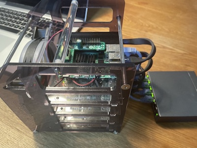
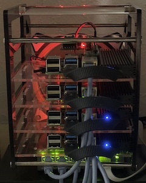

# Raspberry Piによるクラスター構築（ハード編）

おなじみの取り組みですが、自分用の忘備録として残しておく。

ハードウェア構成として参考にしたのが「[Raspberry Pi 4Bで4台構成の自宅クラスター！ ラズパイ4B向けPoE HATを試す](https://internet.watch.impress.co.jp/docs/column/shimizu/1325054.html)」の記事です。

お買物リスト
- Raspberry Pi 4B x 4
- ヒートシンク（お好きなものを）HATとの干渉に注意
- GeekPi Raspberry Pi クラスターケース ZP-0088 x 1
- TP-Linkスイッチングハブ TL-SG1005P x 1
- DSLRKIT Power Over Ethernet PoE HAT for Raspberry Pi 4B 3B+ 5V 2.5A x 1
- UCTRONICS PoE HAT for Raspberry Pi 4 x 1
- Elecom LANケーブル CAT6 15cm LD-GPY/BU015 x 4
- Archgon NVMe PCIe M.2 SSD 外付けケース USB3.1Gen2 MSD-221 x 4
- Samsung MZ-V8V500B/EC (500GB M.2) x 3 (タイムセールで3つまでしか買えませんでした)
- Crucial CT500P2SSD8JP (500GB M.2) x 1
- JulyTek USB Type C (USB C to A 13.7cm) x 4

SSDはお好みでどうぞ。SSDの仕様の違いで使用できるケースが変わりますので注意してください。

## クラスターケースに組み込む前にやっておくこと。

Raspberry Piをクラスターケースに組み込むとmicroSDへのアクセスが難しくなるため、Rasberry PiをUSB起動するように設定する。
全面からアクセスするためのボードも付随しますが本体の右側を使います。右側にSSDドライブを置きたいため、使用しませんでした。左側はUSBなどの端子があるため塞ぎたくないんですよね。

microSDにRasberry Pi OS Liteをインストールし、ログイン（userはpi, パスワードはraspberry）。

`rasp-config`を用いてUSB起動するように設定。

```bash
sudo rasp-config
```

Advanced Options -> Boot Order -> USB Boot

あと、GPUメモリを16MBにしておくとよいという情報もあるが、後でUbuntuに入れ直すので、これは不要かな（この設定はBIOSじゃないよね）

Performance Options -> GPU Memory

## Ubuntu のインストール

Rasberry Pi OSは32-bitなので、64-bitのあるUbuntuをSSDドライブにインストールする。

MacにてRaspberry Pi Imagerを起動し、Ubuntu Serverをインストール。
Other general purpose OS -> Ubuntu -> Ubuntu Server 21.04 (RPi 3/4/400)

（Ubuntu Server 20.04.2 LTSは起動しなかった。）

Raspberry PiのUSBにSSDドライブを接続し、起動。

ログインはubuntu / ubuntu

ログイン後、すぐにパスワードの変更が求められる。

その他にはホスト名の設定を行っています。

```
hostnamectl set-hostname rasp1
```

あと、MACアドレスを確認し、DHCP serverに登録する。

```
ip a
```

これを4台分、繰り返します。

## クラスターケースに組み込み。

あとはクラスターに組み込むだけです。ファンLEDは電流がぎりぎり（実は少し足りていない）ため接続しませんでした。光って見えるのは本体のLEDです。



